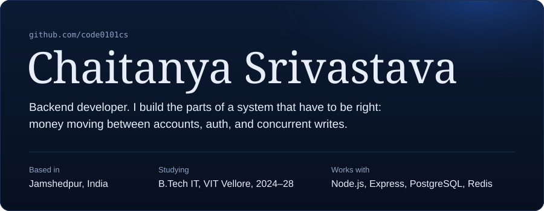
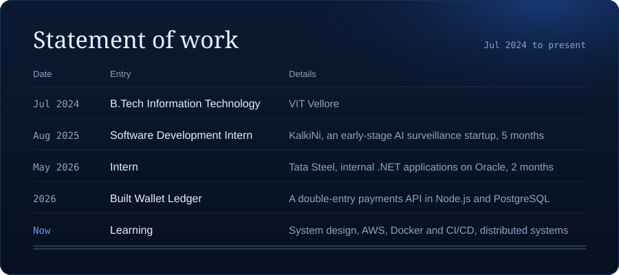
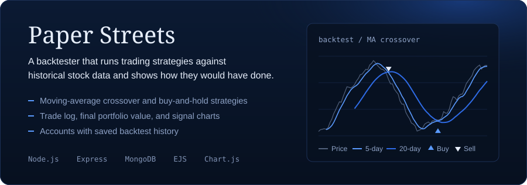
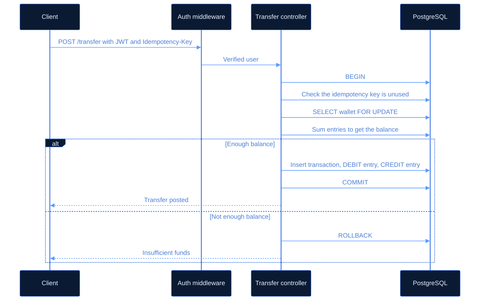

  <a href="https://www.linkedin.com/in/chaitanya-srivastava-904473300/">LinkedIn</a>
  &nbsp;/&nbsp;
  <a href="mailto:srivastavachaitanya408@gmail.com">Email</a>
  &nbsp;/&nbsp;
  <a href="https://leetcode.com/u/chaitanya0111/">LeetCode</a>
  &nbsp;/&nbsp;
  <a href="tel:+919798864033">+91 97988 64033</a>

 

<b>How a transfer moves through Wallet Ledger</b>

 

Every transfer runs inside one PostgreSQL transaction. The sender's wallet row is locked first, so two transfers from the same account queue up instead of racing each other to spend the same balance.

Balance is always `SUM(credits) - SUM(debits)` over the entries table. There is no balance column that could drift out of sync.

<b>The internships in detail</b>

 

**Intern, Tata Steel** May – Jun 2026, Jamshedpur, on-site

Worked on two internal .NET applications running on Oracle. Migrated jQuery 1 to 3 and Bootstrap 3 to 4, and shipped feature work and bug fixes alongside.

**Software Development Intern, KalkiNi** Aug – Dec 2025, Vellore

Joined an AI surveillance startup in its initial stage. The most useful thing I learned there was how to read a codebase I didn't write, which turned out to be harder than writing new code.

<b>What I'm learning right now</b>

 

| | |
|---|---|
| **System design** | Load balancing, horizontal scaling, and where the cache actually belongs |
| **AWS** | EC2, RDS, and getting IAM permissions right without opening everything up |
| **Docker and CI/CD** | So deploys stop being a manual process |
| **Security** | Looking at systems the way an attacker would |
| **Distributed systems** | Eventual consistency, and what breaks when a service stops responding |

<b>Everything I work with</b>

 

| | |
|---|---|
| **Language** | JavaScript |
| **Backend** | Node.js, Express, REST APIs, MVC |
| **Data** | PostgreSQL, MongoDB with Mongoose, Redis |
| **Auth** | JWT, bcrypt, express-session |
| **Server-rendered UI** | EJS, HTML, CSS, Chart.js |
| **Tooling** | Git, Docker, Postman, Linux |

<b>Other projects</b>

 

**[Authentication System](https://github.com/code0101cs/Authentication-System)** &nbsp;Password hashing, sessions and protected routes, built from scratch.

**[Expense Tracker](https://github.com/code0101cs/Expense_Tracker)** &nbsp;A server-rendered app for logging and reviewing expenses.

<b>GitHub activity</b>

 

  
  

  

