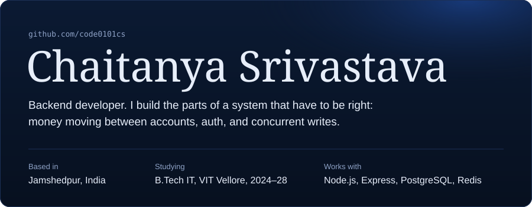
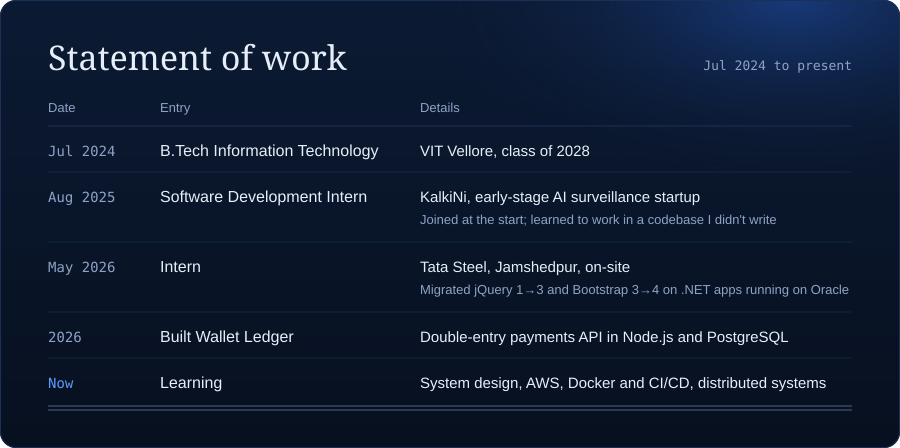
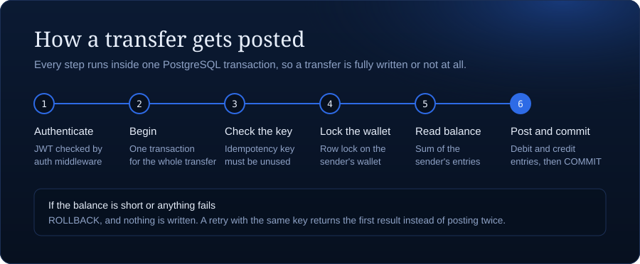
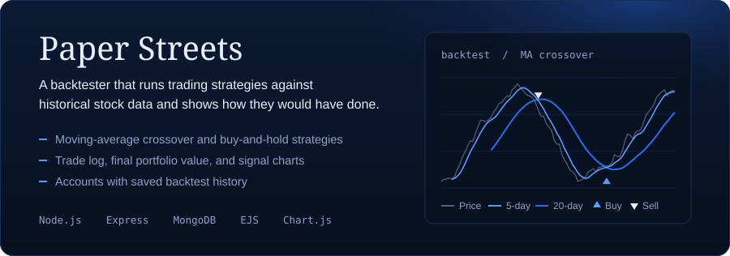
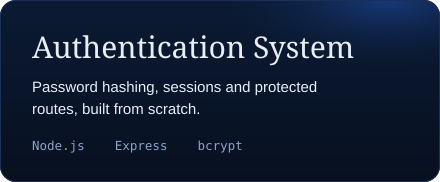
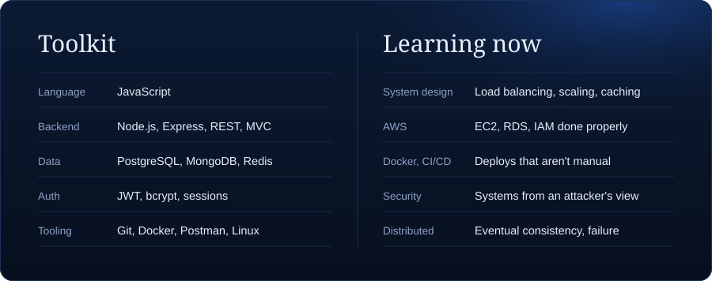

  <a href="https://www.linkedin.com/in/chaitanya-srivastava-904473300/">LinkedIn</a>
  &nbsp;/&nbsp;
  <a href="mailto:srivastavachaitanya408@gmail.com">Email</a>
  &nbsp;/&nbsp;
  <a href="https://leetcode.com/u/chaitanya0111/">LeetCode</a>
  &nbsp;/&nbsp;
  <a href="tel:+919798864033">+91 97988 64033</a>

  
  

  
  

